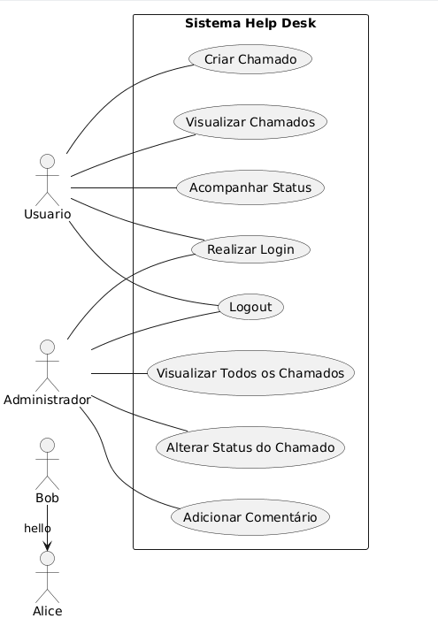

1. Caso de Uso
Nome:

Criar chamado

Atores:

Usuário

Pré-condições:

Usuário autenticado

Pós-condições:

Chamado registrado no sistema

Fluxo Básico:

Usuário acessa o menu de chamados

Usuário seleciona "Novo Chamado"

Sistema exibe formulário

Usuário preenche os dados

Sistema salva o chamado

Fluxos Alternativos:

Dados obrigatórios não preenchidos

# Diagrama de Casos de Uso

O diagrama abaixo representa as interações entre os atores do sistema Help Desk.

