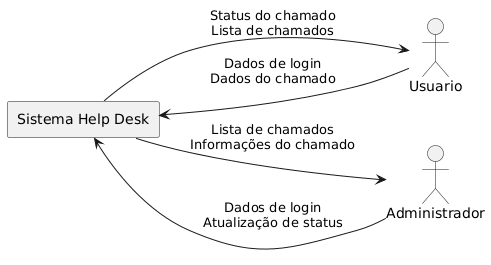
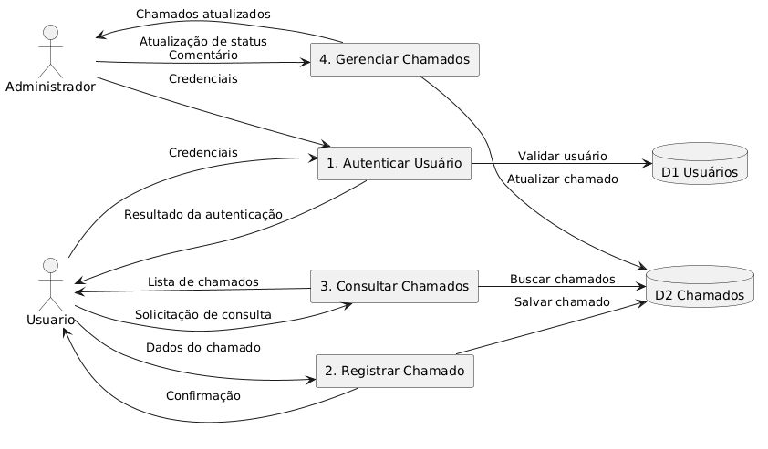

1. Caso de Uso
Nome:

Criar chamado

Atores:

Usuário

Pré-condições:

Usuário autenticado

Pós-condições:

Chamado registrado no sistema

Fluxo Básico:

Usuário acessa o menu de chamados

Usuário seleciona "Novo Chamado"

Sistema exibe formulário

Usuário preenche os dados

Sistema salva o chamado

Fluxos Alternativos:

Dados obrigatórios não preenchidos

# Diagramas do Sistema Help Desk

Este documento reúne os principais diagramas utilizados na modelagem do sistema Help Desk, conforme os conceitos de Engenharia de Requisitos.

---

## 1. Diagrama de Casos de Uso

O diagrama de casos de uso representa as interações entre os atores e o sistema.

*Figura 1 – Diagrama de Casos de Uso do Sistema Help Desk.*

---

## 2. Diagrama de Fluxo de Dados (DFD) – Nível 0

O DFD de nível 0 apresenta uma visão de contexto do sistema, mostrando o sistema como um único processo.

*Figura 2 – DFD Nível 0 (Contexto).*

---

## 3. Diagrama de Fluxo de Dados (DFD) – Nível 1

O DFD de nível 1 detalha os principais processos internos do sistema e seus armazenamentos de dados.

*Figura 3 – DFD Nível 1 do Sistema Help Desk.*

---
